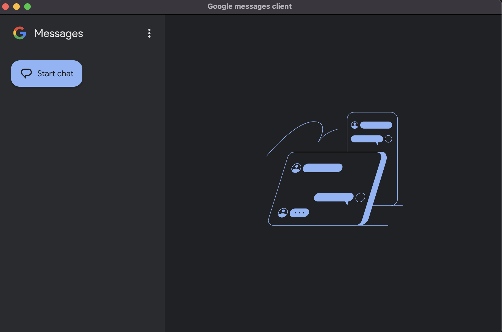

# Google Message Client Desktop - Installation & Setup Guide

### Example Screenshot



## Introduction

Google Message Client Desktop is an open-source Electron-based application that wraps the Google Messages Web interface (messages.google.com/web/conversations) into a standalone desktop application. It does not add any additional functionality but provides an easy way to access and use Google Messages without opening a browser. In the future, only system notifications for incoming messages will be added.

This project is open-source and can be freely used, modified, and distributed under the terms of its license.

Google Message Client Desktop is a simple Electron-based application that wraps the Google Messages Web interface (messages.google.com/web/conversations) into a standalone desktop application. It does not add any additional functionality but provides an easy way to access and use Google Messages without opening a browser.

## Table of Contents

1. [Installation for Regular Users](#installation-for-regular-users)
   - [macOS](#macos)
   - [Windows](#windows)
2. [Pairing Your Phone with the Application](#pairing-your-phone-with-the-application)
3. [Running in Developer Mode](#running-in-developer-mode)
   - [Setting Up Node.js and Yarn](#setting-up-nodejs-and-yarn)
   - [Running the Project](#running-the-project)

---

## Installation for Regular Users

### macOS

#### 1. Download and Install

- Download the latest `.dmg` release from the [GitHub Releases page](https://github.com/pawel-niedzwiecki/google-messages-client/releases/download/v0.0.0/GoogleMessagesClient-mac.dmg).
- Open the `.dmg` file and drag the application to the `Applications` folder.
- Double-click the application to launch it.

#### 2. Grant Permissions (if needed)

- If macOS prevents opening due to security settings, go to `System Preferences > Security & Privacy > General`.
- Click `Open Anyway` for Google Message Client Desktop.

### Windows

#### 1. Download and Install

- Download the latest `.exe` installer from the [GitHub Releases page](https://github.com/pawel-niedzwiecki/google-messages-client/releases/download/v0.0.0/GoogleMessagesClient-windows.exe).
- Run the `.exe` installer and follow the installation steps.
- After installation, launch the application from the Start Menu or Desktop shortcut.

#### 2. Allow Firewall Permissions (if needed)

- If Windows prompts for firewall permissions, click `Allow` to ensure proper network communication.

---

## Pairing Your Phone with the Application

To use Google Message Client Desktop, you must pair it with your phone using a QR code.

### Steps to Pair:

1. **Open the Application**

   - Launch the Google Message Client Desktop app.
   - The app will display a QR code for pairing.

2. **Open Google Messages on Your Phone**

   - Open the `Messages` app on your Android device.
   - Tap on the three-dot menu (`⋮`) in the top-right corner.
   - Select `Device Pairing`.

3. **Scan the QR Code**
   - Tap `QR Code Scanner` and point your phone’s camera at the QR code displayed in the desktop app.
   - Once scanned, your messages will be synced, and you can start using Google Messages on your desktop.

---

## Running in Developer Mode

To contribute to development or modify the application, you need to set up the development environment.

### Setting Up Node.js and Yarn

#### 1. Install Node.js (at least version 20) using `nvm`:

```sh
# Install NVM (if not installed)
curl -fsSL https://raw.githubusercontent.com/nvm-sh/nvm/v0.39.4/install.sh | bash

# Reload shell configuration
source ~/.bashrc  # or source ~/.zshrc for macOS (Zsh users)

# Install and use Node.js 20
nvm install 20
nvm use 20
```

#### 2. Install Yarn:

```sh
npm install -g yarn
```

### Running the Project

#### 1. Clone the repository:

```sh
git clone https://github.com/your-repo/google-message-client-desktop.git
cd google-message-client-desktop
```

#### 2. Install dependencies:

```sh
yarn install
```

#### 3. Start the application in development mode:

```sh
yarn dev
```

The application should now launch in development mode, allowing you to make changes and test them live.

---

## Conclusion

By following this guide, you should be able to install, pair, and run Google Message Client Desktop either as a regular user or as a developer. Enjoy using Google Messages on your desktop seamlessly!
